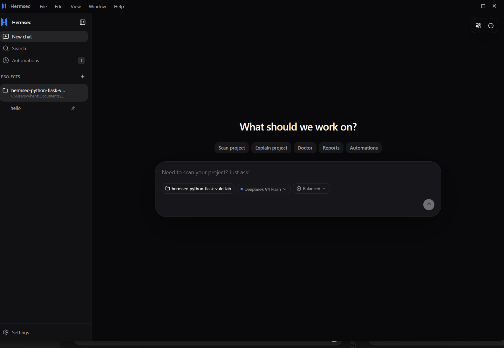
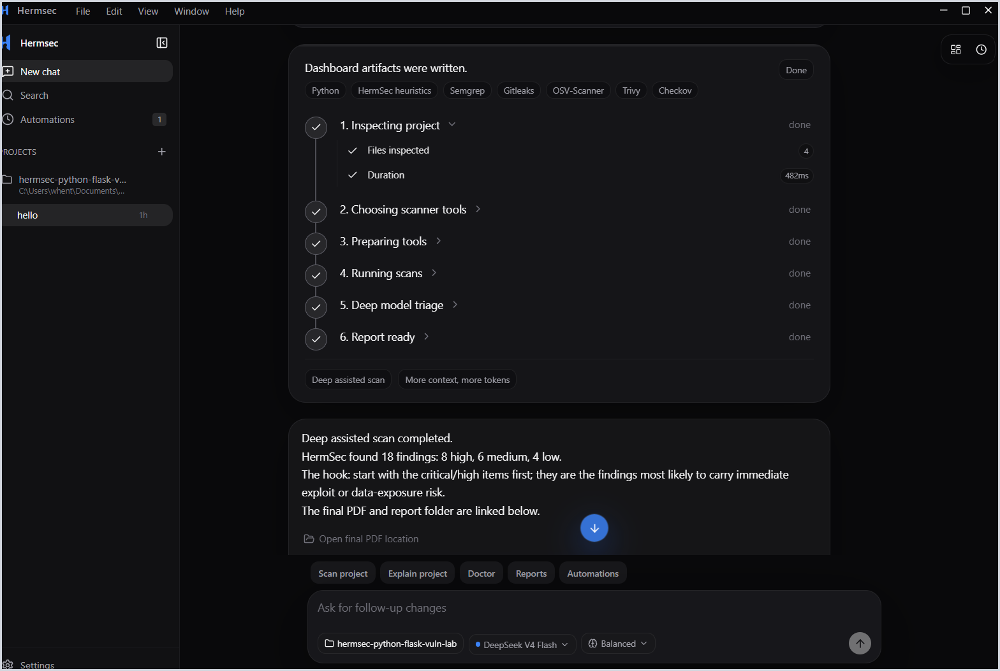
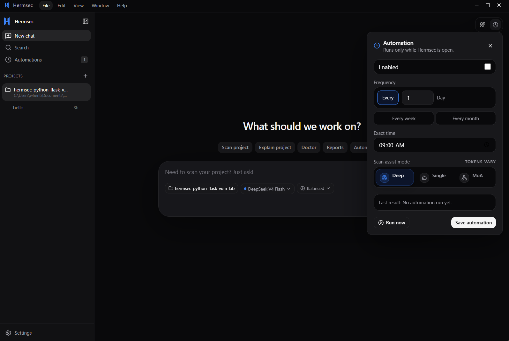
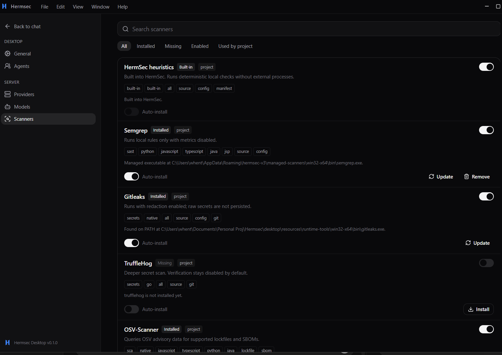
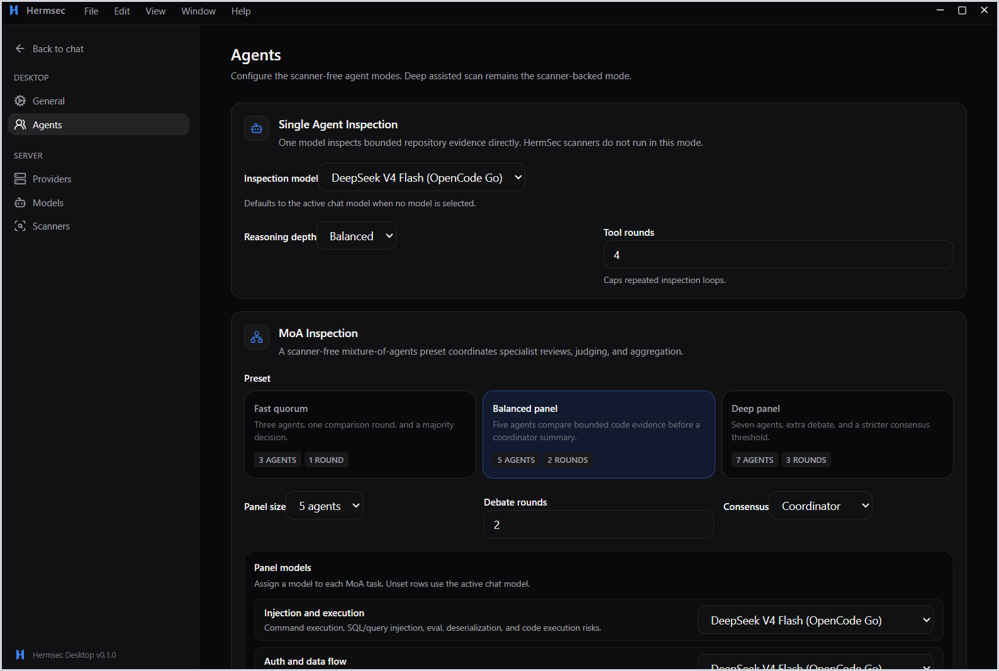
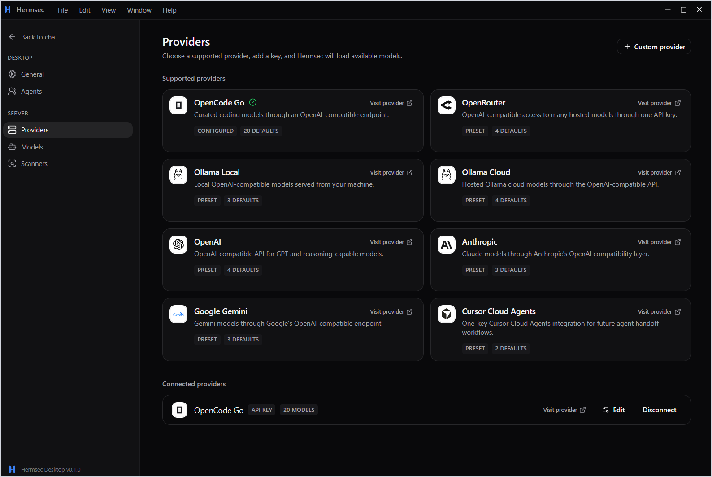

# Hermsec

Hermsec V3 is a local-first desktop security assistant for repositories. It inspects a project, chooses the right defensive scanners, auto-prepares supported missing tools by default, runs static analysis, shows live progress in chat, and writes local dashboard plus final PDF reports.

The app is built for "scan my project and tell me what matters" workflows. It keeps the source repository safe: Hermsec does not install dependencies inside scanned projects, does not run package lifecycle scripts, and keeps model assistance grounded in scanner evidence or bounded read-only repository evidence.

The current product is V3 only. Earlier experimental UI surfaces have been removed from the active tree.

## Screenshots

<p>
  
  
</p>

<p>
  
  
</p>

<p>
  
  
</p>

## Product Overview

Hermsec is organized around a chat-first local scan workflow. A user selects a repository, chooses a scan mode, watches live progress, and opens the generated report artifacts from the final chat summary.

The product surfaces are:

- Home chat for project selection, scan mode selection, progress, and report links.
- Scanner settings for installed, missing, enabled, and project-relevant tools.
- Agent and provider settings for model-backed Single Agent, MoA, judge, and aggregation behavior.
- Doctor checks, automations, and local HTML/PDF/JSON reports for repeatable scans.

## Repository Layout

```text
desktop/       Electron + React V3 desktop app
src/           Root scanner, report, doctor, model, intel, scheduler, and CLI engine
tests/         Root scanner/CLI/unit/integration tests
scripts/       Benchmark and maintenance scripts
docs/          Current install notes, screenshots, research paper, and CLI notes
.github/       Benchmark and desktop release workflows
```

## Installers

Download the latest desktop installers from the [Hermsec GitHub Releases page](https://github.com/sethwhenton/hermsec/releases/latest).

- [macOS Apple Silicon download](https://github.com/sethwhenton/hermsec/releases/latest): download `Hermsec-macos-arm64.dmg`, open it, and drag Hermsec into Applications.
- [macOS Intel download](https://github.com/sethwhenton/hermsec/releases/latest): download `Hermsec-macos-x64.dmg`, open it, and drag Hermsec into Applications.
- [Windows installer download](https://github.com/sethwhenton/hermsec/releases/latest): download `Hermsec-Setup-Windows-x64.exe`, or use `Hermsec-Portable-Windows-x64.exe` for portable mode.

The Windows and macOS release workflows publish assets whenever a `v*` tag is pushed. They can also be run manually from GitHub Actions with an optional release tag.

## Development

Install and verify the root scanner engine:

```powershell
npm ci
npm run typecheck
npm test
```

Install and run the V3 desktop app:

```powershell
npm run desktop:install
npm run desktop:dev
```

Equivalent direct desktop commands:

```powershell
cd desktop
npm ci
npm run dev
```

## Packaging

Build Windows locally:

```powershell
npm run desktop:dist:win
```

Build macOS locally:

```bash
npm run desktop:dist:mac
# or target one architecture on macOS:
npm --prefix desktop run dist:mac:arm64
npm --prefix desktop run dist:mac:x64
```

Generated desktop packages land in `desktop/release/`. The installer and portable builds include the Hermsec CLI/report engine plus the bundled scanner runtime. Do not commit generated packages directly; attach them to GitHub Releases.

Bundled scanner/runtime contents:

- Hermsec CLI/report engine
- Semgrep
- Gitleaks
- Bandit
- OSV-Scanner
- pip-audit
- SafeDep PMG npm audit

After installing, run Doctor from chat to confirm bundled scanners, internet connectivity, and provider readiness.

## App Workflow

Hermsec's normal scan flow is:

1. Inspect the selected repository for languages, manifests, lockfiles, IaC, and framework signals.
2. Select only the scanner lanes that match the project.
3. Auto-install supported missing scanner tools into Hermsec-managed storage when the default auto-install setting is enabled.
4. Run the scanner stack with live progress in chat.
5. Merge scanner evidence and apply the selected model mode.
6. Write local artifacts: HTML report, dashboard bundle, JSON/Markdown data, and a one-page PDF.
7. Show the final PDF path in chat as a local hyperlink so the report location can be opened immediately.

Doctor is available from chat to check the app environment before scanning. It verifies required runtime pieces, bundled scanner readiness, internet connectivity to security/advisory sources, and model/provider readiness.

## Scan Modes

Hermsec V3 exposes three product scan modes:

- `Deep assisted scan`: inspects the project, selects the right scanner lanes, prepares missing supported tools, runs the scanner stack, then uses the selected model to triage scanner-backed evidence.
- `Single agent inspection`: uses one configured model to inspect bounded repository evidence directly. This mode is scanner-free and uses safe read-only code tools.
- `MoA inspection`: uses a mixture-of-agents panel. Specialist agents inspect bounded repository evidence, a false-positive judge reviews candidates, and an aggregator writes the accepted findings.

For research and CLI experiments, Hermsec also includes `scanner-moa-assisted`. This hybrid mode runs scanners and MoA together, then judges and aggregates both candidate sets. It is documented in the Task 5 research bundle below.

Scanner-only runs remain an internal benchmark control.

## Live Progress And Evidence

Scans stream structured progress from the root engine into the desktop chat card. The card is driven by real scan events, including repository inspection, scanner selection, tool preparation, individual scanner starts/completions/failures, model summary status, and report generation. The CLI exposes the same stream in JSON mode as `HERMSEC_PROGRESS` JSONL lines on stderr while keeping the final JSON result on stdout.

Every scanner result crosses a normalization boundary before reporting. Hermsec fills stable fields such as tool, rule id, severity, confidence, category, evidence, remediation, and fingerprint, then normalizes paths relative to the scanned repository. User reports stay redacted, while benchmark-safe raw exports are kept separately so testcase matching is not broken.

Deep assisted mode is evidence-bound. Model output can group, prioritize, explain impact, and suggest remediation, but it is rejected if it invents unsupported file paths, line numbers, packages, CVEs, CWEs, scanner ids, or finding ids.

## Vulnerability Intelligence

Hermsec cross-checks scanner evidence and dependency inventory against trusted advisory sources. During report generation it inventories supported manifests and lockfiles, including npm, Python, Go, Rust, Composer, Ruby, and Maven basics, then matches relevant records from OSV, GitHub Advisory, NVD, and CISA KEV cache/live feeds.

Matched intelligence appears in the JSON, Markdown, HTML, dashboard, and one-page report outputs with the advisory source, package/version, CVE/GHSA/OSV identifiers, fixed version when known, related finding ids, match reasons, and KEV status. If no advisory or KEV entry matches the scanned dependencies or scanner identifiers, reports show an explicit empty state instead of implying a match was found.

## Scanner Harness

The root harness never installs dependencies inside scanned repositories and does not run package lifecycle scripts. It normalizes scanner output into Hermsec findings and report artifacts. V3 uses Settings > Scanners to show supported scanners, install/readiness state, enablement, auto-install preferences, and project applicability.

Fresh desktop installs default to adaptive scanner auto-install. Supported tools are installed into Hermsec-managed storage, not globally and not into the scanned project. System-only scanners are detected and used when already available.

Expanded scanner coverage includes Semgrep, Gitleaks, TruffleHog, OSV-Scanner, Trivy, Checkov, Retire.js, FindSecBugs/SpotBugs, OWASP Dependency-Check, Bandit, pip-audit, Psalm, Composer audit, gosec, govulncheck, cargo-audit, Brakeman, Flawfinder, Cppcheck, and .NET vulnerable package checks. Some optional scanners still require native runtime support before they can be bundled everywhere.

Java coverage includes Hermsec's lightweight servlet taint heuristics for request parameters, headers, cookies, body readers, path/query data, multipart filenames, session attributes, aliases, string concatenation, and `StringBuilder`/`StringBuffer` flows. It recognizes common sanitizer families and checks SQL, LDAP, XPath, file/path, process, servlet response, and session-write sinks.

## Benchmarking

Benchmark work is supported from the root CLI and CI. The current Java gate targets OWASP BenchmarkJava, with benchmark artifacts written under `.hermsec/benchmark-runs` when local suites are available. Recommended expansion suites remain OpenSSF CVE Benchmark for JS/TS, CASTLE and a Juliet subset for C/C++, OWASP BenchmarkPython plus curated fixtures for Python, and labeled dependency/secrets fixtures for SCA and secret scanning.

## Research Paper And Findings

The Task 5 research package is checked into [docs/research/task5-hermsec-moa](docs/research/task5-hermsec-moa). It contains:

- the Overleaf-ready ACM paper source in [overleaf-paper](docs/research/task5-hermsec-moa/overleaf-paper),
- the ACM paper source in [hermsec_moa_paper.tex](docs/research/task5-hermsec-moa/overleaf-paper/hermsec_moa_paper.tex),
- the paper figures and app screenshots,
- fresh actual-run metrics in [results/latest](docs/research/task5-hermsec-moa/results/latest).

The paper direction is: Hermsec as a user-friendly repository scanner, followed by a comparison of static scanner-backed review, single-agent review, multi-agent review, and the Scanner + MoA hybrid. The latest `results/latest/results.json` artifact is an actual OpenCode Go run across 24 mode-and-fixture cells, and the paper tables are filled from that result.

## Provider Keys

Provider keys are read from environment variables or desktop settings that reference environment variables. Keep real keys out of git.

Common variables:

```text
OPENCODE_GO_API_KEY
OPENAI_API_KEY
ANTHROPIC_API_KEY
GEMINI_API_KEY
OPENROUTER_API_KEY
OLLAMA_API_KEY
```

For OpenCode Go, set `OPENCODE_GO_API_KEY`, keep `HERMSEC_MODEL=deepseek-v4-flash`, then enable remote model calls from Settings when model-backed explanations are wanted.

## Scriptable CLI

The root CLI remains available for automation and benchmarks:

```powershell
node dist\src\bin\hermsec.js doctor --json
node dist\src\bin\hermsec.js scan C:\path\to\repo --assist-mode deep-assisted --out .hermsec\reports --html --md --json
npm run eval:owasp
```

For more detail, see [docs/cli-usage.md](docs/cli-usage.md) and [docs/npm-install.md](docs/npm-install.md).
